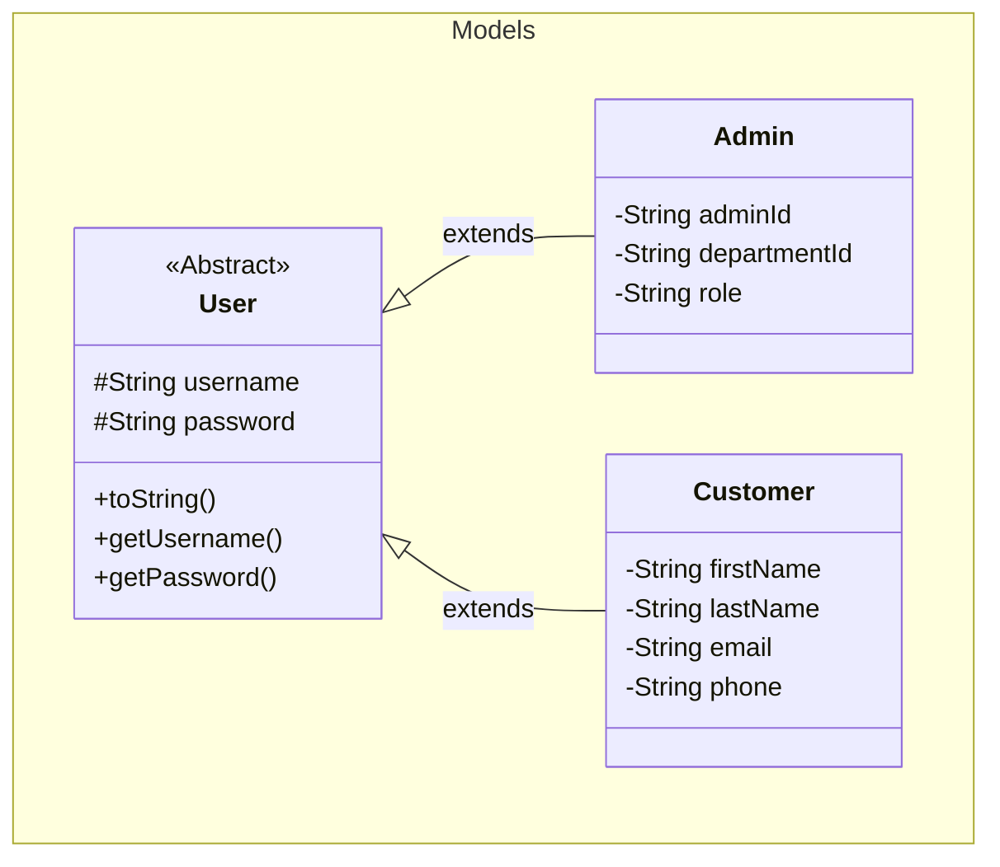
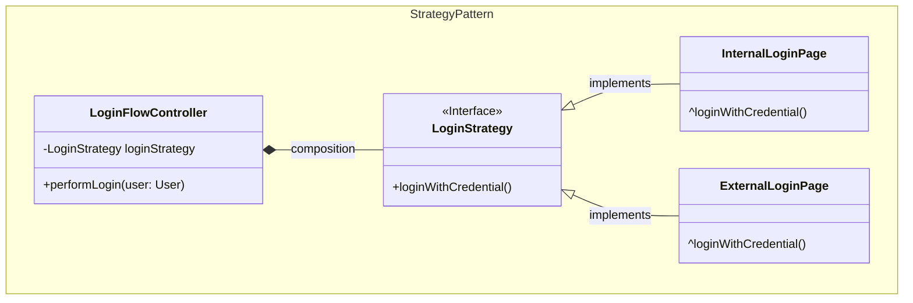
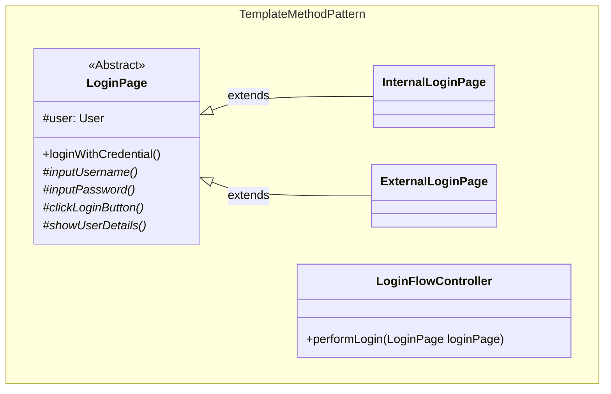
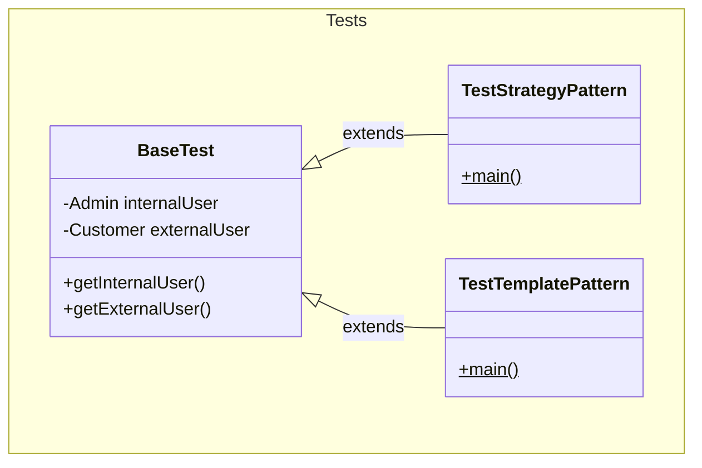

### Models class diagram

```mermaid
classDiagram
    namespace Models {
        class User {
            <<Abstract>>
            #String username
            #String password
            +toString()
            +getUsername()
            +getPassword()
        }
        class Admin {
            -String adminId
            -String departmentId
            -String role
        }
        class Customer {
            -String firstName
            -String lastName
            -String email
            -String phone
        }
    }
    User <|-- Admin:  extends
    User <|-- Customer: extends
```

### Strategy Pattern class diagram

```mermaid
classDiagram
    namespace StrategyPattern {
        class  LoginStrategy {
            <<Interface>>
            +loginWithCredential()
        }
        class InternalLoginPage {
            ^loginWithCredential()
        }
        class ExternalLoginPage {
            ^loginWithCredential()
        }
        class LoginFlowController{
            -LoginStrategy loginStrategy
            +performLogin(user: User)
        }
}
    LoginStrategy <|-- InternalLoginPage : implements
    LoginStrategy <|-- ExternalLoginPage : implements
    LoginFlowController *-- LoginStrategy: composition
```

### Template Method Pattern class diagram

```mermaid
classDiagram
    namespace TemplateMethodPattern {
        class LoginPage {
            <<Abstract>>
            #user: User
            +loginWithCredential()
            #inputUsername()*
            #inputPassword()*
            #clickLoginButton()*
            #showUserDetails()*
        }
        class InternalLoginPage {
        }
        class ExternalLoginPage {
        }
        class LoginFlowController{
            +performLogin (LoginPage loginPage)
        }
    }
    LoginPage <|-- InternalLoginPage : extends
    LoginPage <|-- ExternalLoginPage : extends
```

### Tests class diagram

```mermaid
classDiagram
    namespace Tests {
        class BaseTest{
            -Admin internalUser
            -Customer externalUser
            +getInternalUser()
            +getExternalUser()
        }
        class TestStrategyPattern{
            +main()$
        }
        class TestTemplatePattern{
            +main()$
        }
    }
    BaseTest <|-- TestStrategyPattern : extends
    BaseTest <|-- TestTemplatePattern : extends
```